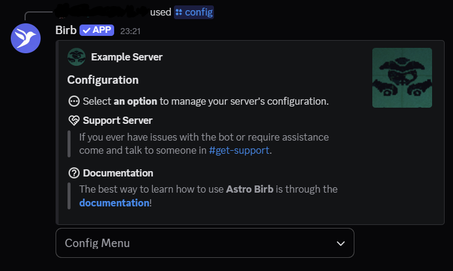
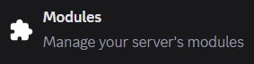

<Steps>
  <Step title="How to enable Modules">
    1. Run `/config` in your server.  
       

    2. You should see an embed menu. Click `Config Menu` at the bottom.  
       

    3. Click `Modules` from the list.  
       

    4. Click the `Modules` dropdown. Now you should see a list of Modules.  
       

    5. Select all Modules you want to enable. Then press somewhere outside the dropdown to apply your changes.
  </Step>

  <Step title="Module Configuration">
    1. Run `/config` in your server.
    2. Click `Config Menu` at the bottom.
    3. Click the Module you want to configure from the list.
    4. Fill out the fields as needed.
  </Step>
</Steps>