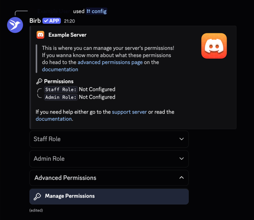
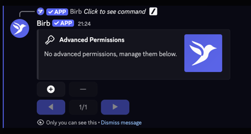

Astro Birb uses a default permission structure of a staff role and an admin role. The staff role marks staff who
are able to respond to modmail/tickets, and are able to be infracted/promoted etc. The admin role is for your
administrators, who are able to issue infractions, manage staff and other functionality.

<Accordion title="Full Permission List">
    <Tabs>
        <Tab title="Admin Role">
            - **/infraction issue** - Issues an infraction to a user.
            - **/infraction view** - View and manage a infraction
            - **/infraction list** - Views the infractions of a user.
            - **/suspend** - Suspends a user from the community.
            - **/promote** - Promotes a member in the staff hierarchy.
            - **/tags edit** - Edits a pre-existing tag.
            - **/tags create** - Creates a new tag.
            - **/loa manage** - Manages Leave of Absence (LOA) requests.
            - **/staff add** - Adds a member to the staff.
            - **/staff remove** - Removes a member from the staff.
            - **/staff view** - Views staff members.
            - **/modmail snippets create** - Creates a modmail snippet.
            - **/modmail snippets delete** - Deletes a modmail snippet.
            - **/modmail snippets all** - Shows all modmail snippets.
            - **/admin panel** - Accesses the admin panel.
            - **/loa active** - Views active LOAs.
            - **/staff panel** - Displays all staff members in a dropdown.
            - **/staff list** - Sends the staff list of all the staff members and their rank.
            - **/tickets panel** - Creates a ticket panel
            - **/quota activity view** - Views the activity result of your staff.
            - **/quota activity wave** - Uses infractions to infract staff members based on their activity.
            - **/quota reset** - Resets the messages of all staff members.
            - **/quota export** - Exports the messages of all staff members to a CSV file.
            - **/quota manage** - Manage your staffs messages.
        </Tab>
        <Tab title="Staff Role">
            - **/staff leaderboard** - Views the staff performance leaderboard.
            - **/quota messages** - Views or manages staff messages.
            - **/modmail reply** - Replies to a modmail thread.
            - **/modmail close** - Closes a modmail thread.
            - **/modmail alert** - Sends an alert next time someone messages in the modmail.
            - **/modmail snippets send** - Sends a snippet message into the modmail channel.
            - **/loa request** - Requests a Leave of Absence.

        </Tab>
</Tabs>
</Accordion>

<Note>This list is not continually updated, so may be out of date. </Note>

## Custom Permissions

Astro Birb also allows you to setup custom permissions. You can grant a specific role access to additional roles. Below is a guide:

<Steps>
    <Step title="Open the permissions menu">
        Open the permissions menu by going to `/config` and then selecting Config Menu.
    </Step>
    <Step title="Start configuring advanced permissions">
        Open the advanced permissions menu by selecting advanced permissions
        
    </Step>
    <Step title="Add a custom permission">
        Press the + button to add a custom permission.
        

        Then, select the command(s) you wish to add advanced permissions to. You can then select which roles
        you wish to have access to that command.
    </Step>
</Steps>

<Note>
You can then manage your advanced permissions you have set through the same steps, except using the — button to
remove advanced permissions.
</Note>
