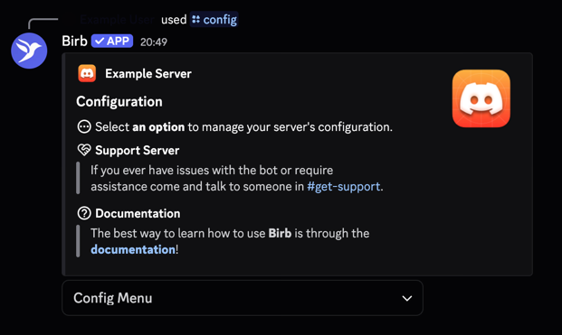
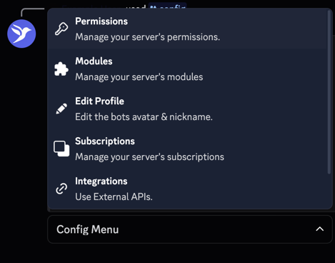
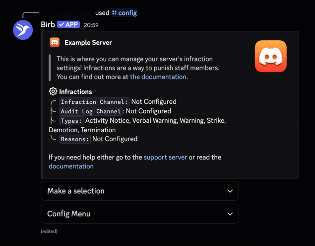

This quick guide on getting started covers a basic setup of your staff role, your admin role, and then introduces
you on how to start setting up modules.

This guide assumes that you have already invited the bot and granted the necessary permissions to it that it requests
when you are adding it to a server.

<Steps>
    <Step title="Run /config">
        Once you have invited the bot, run `/config`.
        
    </Step>
    <Step title="Select Permissions">
        
    </Step>
    <Step title="Set Roles">
        Set your staff role(s) to a list of roles you want to be considered "staff", such as those who you can infract,
        and those who can request LOAs. Set your admin role(s) to those who you want to have elevated permissions to
        manage staff.
        
    </Step>
    <Step title="Modules">
        Let's enable some modules now. Run `/config` again, and this time select modules in the dropdown. You can then
        select a module to configure. For this guide, we will do infractions. It will then be enabled, and you can
        select it from the "Config Menu" at the bottom of the /config menu. You can then individually configure settings
        for that module as shown below.
        
    </Step>
</Steps>